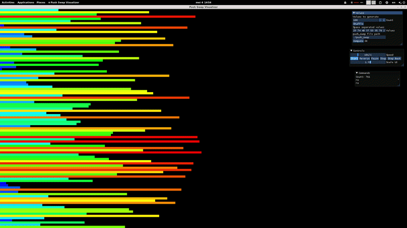

# push_swap

A sorting algorithm project written in C that sorts a stack of integers using a limited set of operations.  
The goal is to sort data with the smallest possible number of instructions, emphasizing algorithmic efficiency and complexity analysis.

This project is part of the [Codam](https://www.codam.nl/en/) curriculum, [42 School](https://42.fr/en/homepage/) campus, and focuses on problem-solving, data structures, and algorithm optimization.

<p align="center">

</p>

## Prerequisites

Before building the project, ensure you have the following installed:

- GNU Make
- GNU Compiler Collection:
  - `gcc` (C compiler)

Install dependencies on Debian/Ubuntu-based systems:

```
sudo apt update && sudo apt install make gcc
```

## Installation

1.  Clone the repository:

```
git clone https://github.com/YellowFlash1040/push_swap
cd push_swap
```

2.  Build the project:

```
make
```

This will create an executable named `push_swap`

```
make bonus
```

This will create an executable named `checker`

## Usage

Run the program with a list of integers as arguments:

```
./push_swap 2 1 3 6 5 8
```

The program will output a sequence of instructions to sort the stack.
To get the list of possible instructions see "Allowed Operations" section

If you compiled the checker binary you can check if the instructions printed by the push_swap binary actually sort the given sequence

```
./push_swap 2 1 3 | ./checker 2 1 3
```

## Allowed Operations

The program can only use the following operations:

### Swap

- `sa` – swap the first 2 elements of stack A
- `sb` – swap the first 2 elements of stack B
- `ss` – `sa` and `sb` at the same time

### Push

- `pa` – move the top element from B to A
- `pb` – move the top element from A to B

### Rotate

- `ra` – shift all elements of stack A up by 1
- `rb` – shift all elements of stack B up by 1
- `rr` – `ra` and `rb` at the same time

### Reverse Rotate

- `rra` – shift all elements of stack A down by 1
- `rrb` – shift all elements of stack B down by 1
- `rrr` – `rra` and `rrb` at the same time

## Program Rules

- You have two stacks: **A** and **B**
- Stack A starts filled with integers (no duplicates)
- Stack B starts empty
- The goal is to sort stack A in ascending order
- You must use the fewest operations possible

## Error Handling

The program handles:

- Non-integer arguments
- Duplicate numbers
- Integer overflow/underflow
- Invalid input formatting
- Empty input

In case of error, the program must output:

```
Error
```

If you provide an empty sequence (meaning no input), the program will just exit, giving you no output.
The empty sequence is a sorted sequence after all.

## Testing

Example:

```
ARG="4 67 3 87 23"; ./push_swap $ARG | wc -l
```

Check correctness:

```
ARG="4 67 3 87 23"; ./push_swap $ARG | ./checker $ARG
```

## Visualisation

To visualize execution of the output given by the program you can use a "push_swap visualiser" that you can find by this link https://github.com/o-reo/push_swap_visualizer

## Algorithm

### First phase:

- Determine the median of stack A. Call the set of values that are less than that median X, and the set of the remaining values Y.

- Determine the median of X.

- Move all values in X that are less than the second median to the bottom of stack B and all values in X that are greater than that median to the top of stack B. Values in Y should just rotate to the bottom of stack A.

- Now stack A has half its original size, and stack B has two partitions: its top half has values that are all greater than its bottom values

- Repeat the above until A is only left with 3 values. Sort those three values. Stack B will end up with several partitions of varying size. The outermost partitions will have the greatest values, and the innermost will have the lesser values.

### Second phase:

#### In this phase stack A will always be circularly sorted, i.e. it only needs rotations to be sorted.

- Repeatedly take a value from stack B and insert it into the sorted index in stack A, i.e. at the single position where the above invariant is not broken. Calculate which one of the possible candidate values in Stack B requires the least operations to do that. Both stacks may need rotations: B rotates the chosen value to its top, and A rotates to bring the desired insert position at its top. If either stack was rotated to retrieve and accept the value, these rotations don't need to be reversed after the push. Make use of the combined operators (rr, rrr) when possible.

- Repeat the above until stack B is empty.

- Rotate stack A so that its greatest value is at the bottom.
